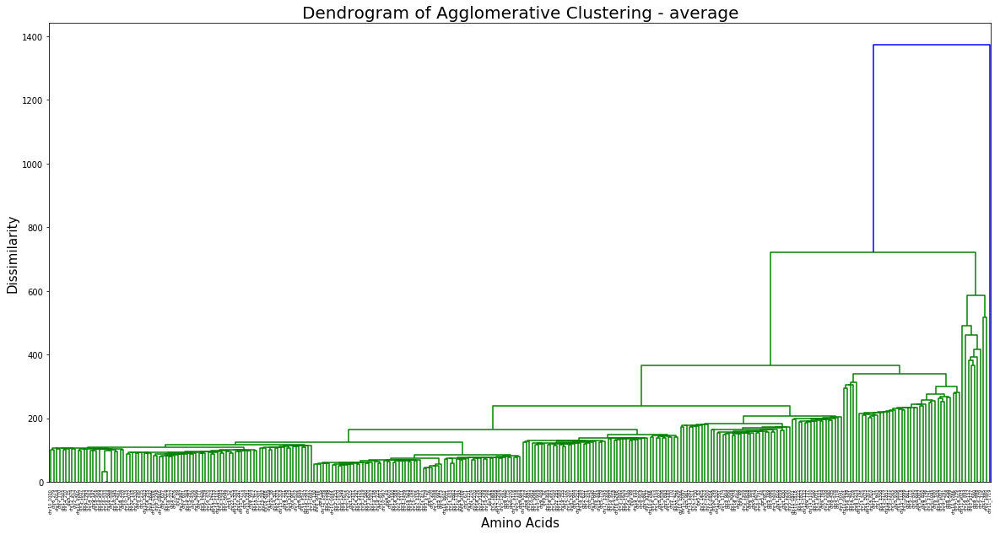
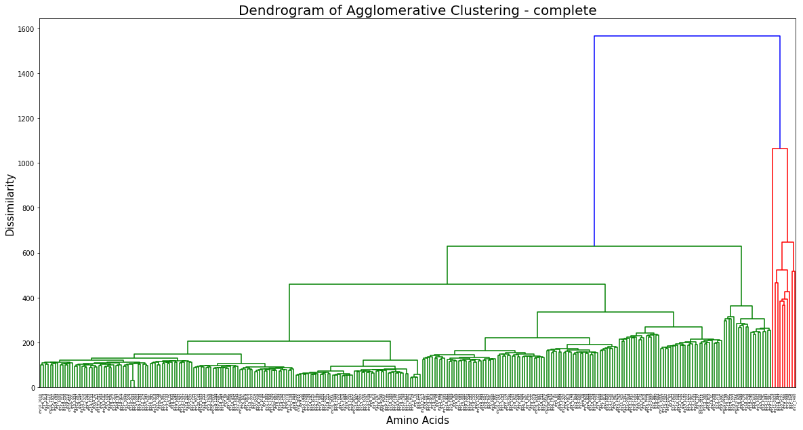
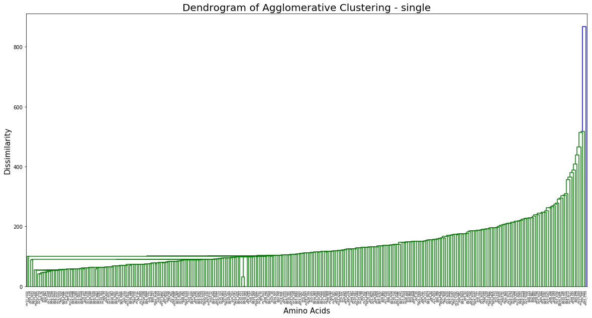
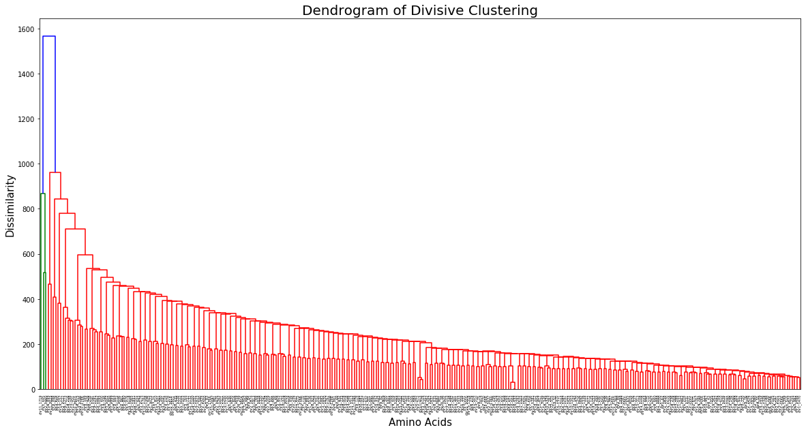

# K-Means, Agglomerative and Divisive Hierarchical CLustering:

Assignment 2 CS F415- Data Mining

==> Data
We used the **Amino acid sequence** dataset, which can be found [here](http://genome.crg.es/datasets/ggalhsapgenes2005/hg16.311.putative.aa.fa). The dataset contains **311 Amino acid sequences**. 
The data can be found in the folder **'data'**.

==> Instructions to run the scripts
Run the following command:

===> K mediods
```python
python kmeans.py
```

===> Divisive clustering
```python
python Divisive.py
```

===> Agglomerative clustering
```python
python Agglomerative.py

===> Machine specs
Processor: i7-7500U

Ram: 12 GB 

OS: Windows 10

===> Results

The clusters obtained for various values of k have been stored in the 
text files in the Results folder.

CLustering was performed using the agglomerative and divisive methods and the following dendrograms were obtained-

===> Agglomerative





===> Divisive



===> Group Members

ROHITH SARANGA (ID: 2017A7PS0034H)
KAUSHIK PERIKA (ID: 2017A7PS0207H)
MAHESH BABU (ID: 2017A7PS0235H)
